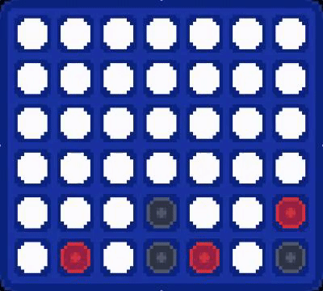

# CMPT310 D200 Group 30 Connect 4 Reinforcement Learning Agent



## Packages needed
- NumPy
- Pettingzoo
- PyTorch

## How to run project
1) To train a new agent/train the existing agent, run the main.py file: `python main.py`
2) To evaluate the currently saved agent, run the evaluate_agent.py file: `python evaluate_agent.py`
3) To play against the currently saved agent, run the play_with_agent.py file: `python play_with_agent.py`

## Overview

This project implements a Connect 4 agent using Deep Q-Learning, a reinforcement learning technique that learns optimal gameplay strategies through self-play against a random opponent. The agent learns to evaluate the board positions and select moves that maximize its probability of winning.


## AI Methods Used

Deep Q-Learning is the core AI method we used in this project. The system uses a neural network to approximate Q-values for each possible action. We used a double DQN architecture to separate policy and target networks to stabilize training. We also utilized experience replay memory, that stores past transitions to break correlation between consecutive training samples.
For exploration our model is using Epsilon-Greedy, this allows it to learn a lot early then hone in on learned strategies. Another method we used to improve our model is reward shaping. We added bonus rewards for dropping a piece in the three center columns, which is strategically advantageous in Connect 4.


## AI Pipeline

The game state is a 6*7 board, with 2 layers, the first is the current players pieces labeled 1 and empty spaces labeled 0, while the second layer is the opponents pieces labeled 1 and empty spaces 0.

### AI Pipeline

### AI Pipeline
```
Game State (6 × 7 × 2)    
|    
├─ Preprocessing    
|  └─ Flatten to 84 features    
|    
├─ Deep Q-Network (DQN)    
|  ├─ Input: 84 neurons    
|  ├─ Hidden 1: 256 neurons + ReLU    
|  ├─ Hidden 2: 128 neurons + ReLU    
|  └─ Output: 7 Q-values    
|    
├─ Action Selection    
|  ├─ Training: Epsilon-greedy    
|  ├─ Evaluation: Max Q-value    
|  └─ Mask invalid moves    
|    
├─ Environment Interaction    
|  └─ Execute move on board    
|       
├─ Experience Replay    
|  └─ Store transition    
|    
├─ Batch Training    
|  ├─ Sample mini-batches    
|  ├─ Compute MSE loss    
|  └─ Backpropagation    
|    
└─ Target Network Update    
   └─ Periodic update
```

